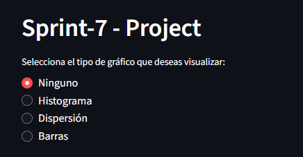
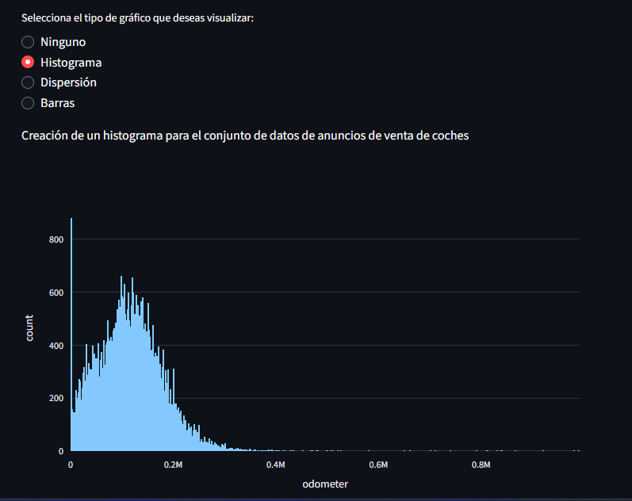
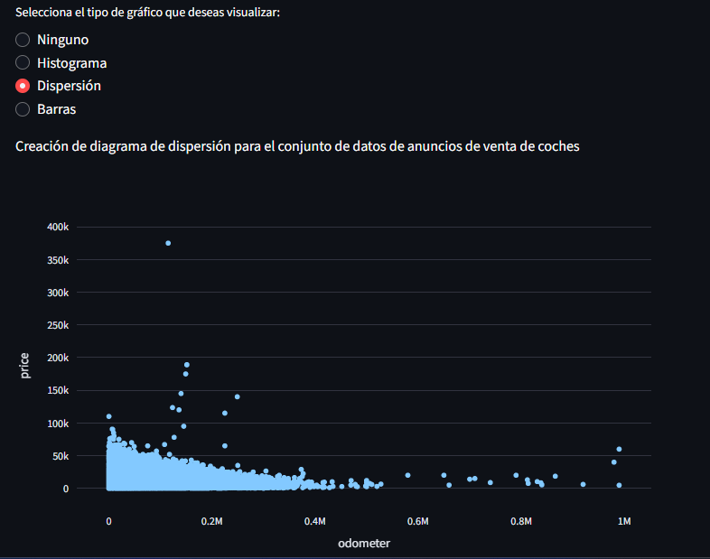
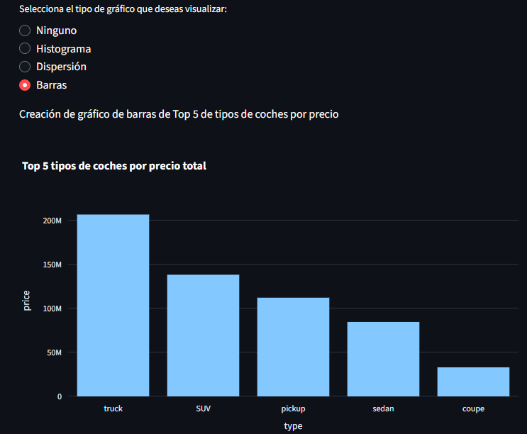

# sprint7_project
A repository to store the Sprint-7 project data

## Project App
Proyecto del Sprint 7.
Este proyecto crea una aplicación sencilla con *Render.com*, el cual construye diagramas tomando como origen un set de datos de información de venta de coches.

La app pretende poder generar tres tipos de diagramas (histograma, dispersión y barras) mediante la selección de un radio button situado en la parte superior de la pantalla.

### Despliegue en Render.com
URL del proyecto:
*https://sprint7-project-l77d.onrender.com*

#### Imagenes del proyecto en Render.com
- Inicio de la app
*Al principio la app muestra una serie de opciones en la parte superior para construir tres tipos de diagramas*

- Diagrama 1
*Seleccionando la opción de Histograma*

- Diagrama 2
*Seleccionando la opción Dispersión*

- Diagrama 3
*Seleccionando la opción Barras*

